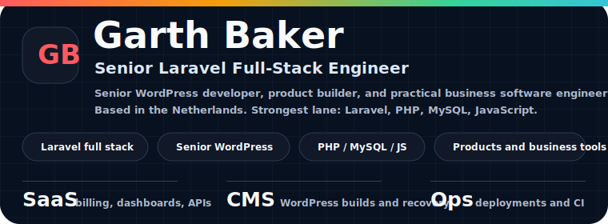
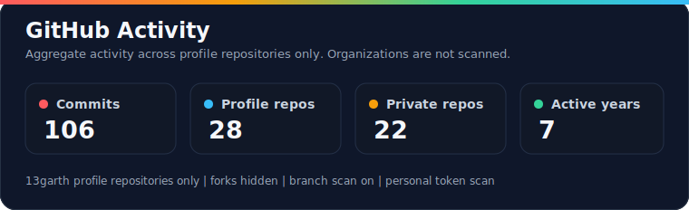
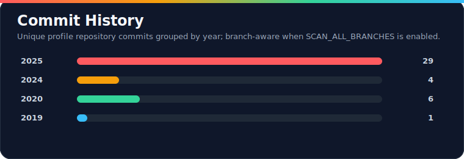
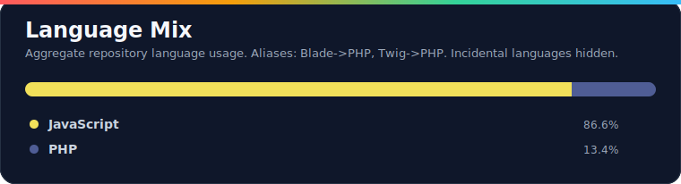

 

<a href="https://13garth.github.io"><strong>Portfolio</strong></a>
&nbsp;&middot;&nbsp;
<a href="https://www.linkedin.com/in/13garth"><strong>LinkedIn</strong></a>
&nbsp;&middot;&nbsp;
<a href="https://BudgetKicker.com"><strong>Budget Kicker</strong></a>
&nbsp;&middot;&nbsp;
<a href="https://coverweb.online"><strong>CoverWeb</strong></a>
&nbsp;&middot;&nbsp;
<a href="https://stackoverflow.com/users/8125278/13garth"><strong>Stack Overflow</strong></a>

---

## About

I am **Garth Baker**, a South African-born full stack software engineer based in the Netherlands.

My strongest lane is **Laravel full-stack engineering**: business systems, APIs, admin panels, reporting workflows, billing tools, deployments, and maintainable PHP/MySQL applications.

I am also a **senior WordPress developer**. WordPress is not my main product focus, but I can use it deeply when it is the right tool: custom builds, theme and plugin work, migrations, troubleshooting, performance fixes, hosting handovers, and client-ready delivery.

I have been building professionally since **2016**, with a practical range that covers discovery, wireframes, responsive UI, backend integration, deployment, documentation, and handover.

I like building practical software that earns trust because it solves real operational problems.

---

## Engineering Focus

<table>
  <tr>
    <td width="50%" valign="top">
      <strong>Laravel Full Stack</strong>
      <ul>
        <li>Laravel apps, APIs, queues, jobs, auth, billing, reports</li>
        <li>MySQL/MariaDB data modeling and query work</li>
        <li>Admin dashboards and internal operations tools</li>
        <li>Deployment workflows, GitHub Actions, VPS/shared hosting</li>
      </ul>
    </td>
    <td width="50%" valign="top">
      <strong>Senior WordPress</strong>
      <ul>
        <li>Custom themes, plugins, templates, and admin workflows</li>
        <li>WooCommerce and content-heavy business websites</li>
        <li>Migration, recovery, hosting, speed, and maintenance work</li>
        <li>Practical client delivery without overengineering</li>
      </ul>
    </td>
  </tr>
  <tr>
    <td width="50%" valign="top">
      <strong>Product Builder</strong>
      <ul>
        <li>SaaS-style tools and paid product ideas</li>
        <li>Billing, invoicing, budgeting, and customer workflows</li>
        <li>Reusable utilities that reduce repeated development work</li>
      </ul>
    </td>
    <td width="50%" valign="top">
      <strong>Learning Edge</strong>
      <ul>
        <li>C#, ASP.NET, and Blazor</li>
        <li>Flutter and Dart when mobile makes sense</li>
        <li>Careful AI-assisted development with real understanding</li>
      </ul>
    </td>
  </tr>
</table>

---

## Stack

**Core**

<kbd>PHP</kbd> <kbd>Laravel</kbd> <kbd>MySQL</kbd> <kbd>MariaDB</kbd> <kbd>JavaScript</kbd> <kbd>jQuery</kbd> <kbd>Vue.js</kbd> <kbd>HTML5</kbd> <kbd>CSS</kbd> <kbd>Bootstrap</kbd>

**WordPress**

<kbd>Senior WordPress</kbd> <kbd>WooCommerce</kbd> <kbd>Custom plugins</kbd> <kbd>Custom themes</kbd> <kbd>Migrations</kbd>

**Platforms, Tools & Expanding Range**

<kbd>REST APIs</kbd> <kbd>Postman</kbd> <kbd>GitHub Actions</kbd> <kbd>Docker</kbd> <kbd>AWS</kbd> <kbd>Linux</kbd> <kbd>Apache</kbd> <kbd>IIS</kbd> <kbd>Flutter</kbd> <kbd>Dart</kbd> <kbd>C#</kbd> <kbd>ASP.NET</kbd> <kbd>Blazor</kbd> <kbd>Figma</kbd>

---

## Featured Work

| Project | What It Shows |
|---|---|
| [Budget Kicker](https://BudgetKicker.com) | Personal finance and business billing product thinking: recurring costs, shared expenses, customer invoices, templates, and reporting. |
| [CoverWeb](https://coverweb.online) | Hosting, domains, customer workflow, and business operations brought together under a practical software/hosting brand. |
| [Portfolio / CV](https://13garth.github.io) | Public professional profile showing experience, technical range, and project direction. |
| [Detailed CV](https://g-portfolio.garthbaker.co.za/) | Longer-form public CV with work history, project examples, skill breakdowns, and problem-solving notes. |
| [API Status Checker](https://github.com/13garth/api-status-checker-basic-local) | Local URL/API/domain health checking utility for fast operational checks. |
| [Bootstrap Reusable Confirm Modal](https://github.com/13garth/bootstrap-re-usable-confirm-modal) | Small reusable UI utility that removes repeated modal code. |
| [PHP MySQL Connector](https://github.com/13garth/php-mysql-connector) | Lightweight PHP/MySQL utility work and older LAMP-stack foundations. |

---

## Public CV Signals

| Signal | Detail |
|---|---|
| Professional experience | Full stack development from 2016 onward across Laravel, PHP, WordPress, responsive UI, Flutter, AWS, and client delivery. |
| End-to-end delivery | Comfortable moving from requirements and wireframes through frontend, backend, deployment, documentation, support, and handover. |
| Community footprint | Public [Stack Overflow](https://stackoverflow.com/users/8125278/13garth) history across PHP, CSS, JavaScript, HTML, WordPress, and Laravel topics. |
| Builder mindset | Product ideas, reusable developer utilities, business workflow tools, and practical automation. |

---

## Current Direction

- Build strong Laravel products with practical business value.
- Keep WordPress as a senior delivery skill for the projects where it wins.
- Turn repeated client/business workflows into reusable systems.
- Improve deployment, automation, billing, reporting, and API integration patterns.
- Grow C#, ASP.NET, and Blazor skill while keeping Laravel as the main strength.

---

## How I Work

| Area | My Approach |
|---|---|
| Business value | Start with the operational problem and the user workflow. |
| Architecture | Keep the first version understandable, then refactor toward clearer boundaries. |
| UI | Build interfaces that make decisions and next actions obvious. |
| APIs | Keep integrations predictable, testable, and documented enough to hand over. |
| WordPress | Use it pragmatically: fast delivery, clean customization, stable ownership. |
| Maintenance | Prefer code that future me, teammates, or clients can understand. |

---

## GitHub Stats

 
 

 
 

> These cards are regenerated by GitHub Actions on pushes to `main`. They scan repositories under my GitHub profile only; organizations are not scanned, and repository source code is never written into the README.

---

## Links

| Platform | Link |
|---|---|
| GitHub | [github.com/13garth](https://github.com/13garth) |
| Portfolio / CV | [13garth.github.io](https://13garth.github.io) |
| Detailed CV | [g-portfolio.garthbaker.co.za](https://g-portfolio.garthbaker.co.za/) |
| Blog | [GarthBaker.co.za](https://GarthBaker.co.za) |
| LinkedIn | [linkedin.com/in/13garth](https://www.linkedin.com/in/13garth) |
| Stack Overflow | [stackoverflow.com/users/8125278/13garth](https://stackoverflow.com/users/8125278/13garth) |
| Budget Kicker | [BudgetKicker.com](https://BudgetKicker.com) |
| CoverWeb | [coverweb.online](https://coverweb.online) |

---

Build useful software. Keep improving it.

